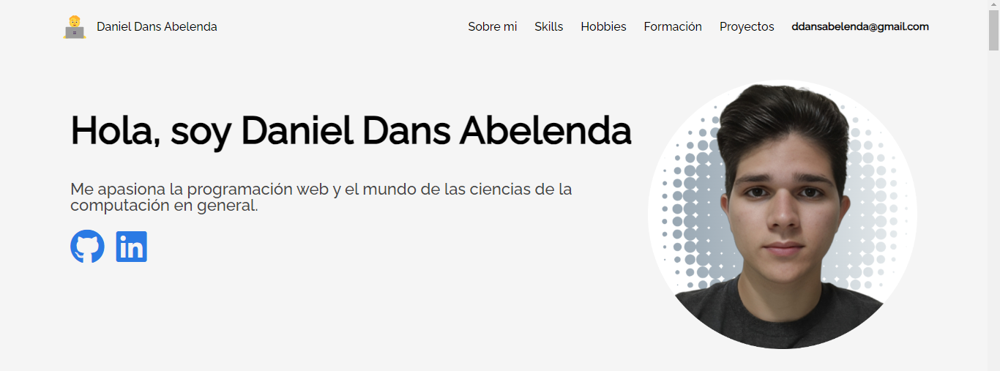

# Portafolio Personal



Este proyecto es un portafolio personal desarrollado como parte de un challenge de [Alura Latam](http://www.aluracursos.com/). El portafolio presenta información sobre mis habilidades, proyectos, y experiencias, y está diseñado para ser una carta de presentación profesional en línea.

## Tabla de Contenidos

- [Descripción](#descripción)
- [Tecnologías Utilizadas](#tecnologías-utilizadas)
- [Instalación](#instalación)
- [Uso](#uso)
- [Características](#características)
- [Contribuir](#contribuir)
- [Licencia](#licencia)
- [Créditos](#créditos)

## Descripción

El portafolio personal está diseñado para mostrar mis habilidades y proyectos de una manera profesional y atractiva. Incluye secciones para mis habilidades técnicas, proyectos destacados y formas de contacto. Este proyecto fue desarrollado como parte del challenge de [Alura Latam](http://www.aluracursos.com/) para poner en práctica mis conocimientos en desarrollo web.

## Tecnologías Utilizadas

- **HTML5**: Para la estructura del portafolio.
- **CSS3**: Para el diseño y la presentación visual.
- **JavaScript**: Para la interactividad y la funcionalidad dinámica.

## Instalación

Para ejecutar este proyecto en tu máquina local, sigue estos pasos:

1. Clona el repositorio a tu máquina local.

```bash
git clone https://github.com/DDansAbelenda/challenge-one-portafolio.git
cd challenge-one-portafolio
```

2. Abre el archivo `index.html` en tu navegador web favorito.

```bash
open index.html
```

## Uso

Explora las diferentes secciones del portafolio:

- **Inicio**: Una breve introducción y bienvenida.
- **Sobre Mí**: Información sobre mi trayectoria.
- **Skills**: Información sobre mis habilidades
- **Hobbies**: ¿Qué me gusta hacer cuando no estoy programando?
- **Formación**: Lugares y plataformas donde desarrollé mis habilidades 
- **Proyectos**: Una galería de mis proyectos destacados con enlaces.
- **Contacto**: Formas de contactarme, incluyendo un formulario de contacto.

## Características

- Diseño responsivo que se adapta a diferentes tamaños de pantalla.
- Secciones bien organizadas y fáciles de navegar.
- Formulario de contacto funcional.

## Contribuir

Las contribuciones son bienvenidas. Si deseas mejorar el portafolio o agregar nuevas características, sigue estos pasos:

1. Haz un fork del repositorio.
2. Crea una nueva rama (`git checkout -b feature/nueva-caracteristica`).
3. Realiza tus cambios.
4. Haz un commit de tus cambios (`git commit -m 'Agrega nueva característica'`).
5. Empuja tu rama (`git push origin feature/nueva-caracteristica`).
6. Abre un Pull Request.

## Créditos

Este portafolio fue desarrollado como parte de un challenge de [Alura Latam](http://www.aluracursos.com/). Agradecimientos especiales a los instructores y a la comunidad de ALURA por su apoyo y recursos.
